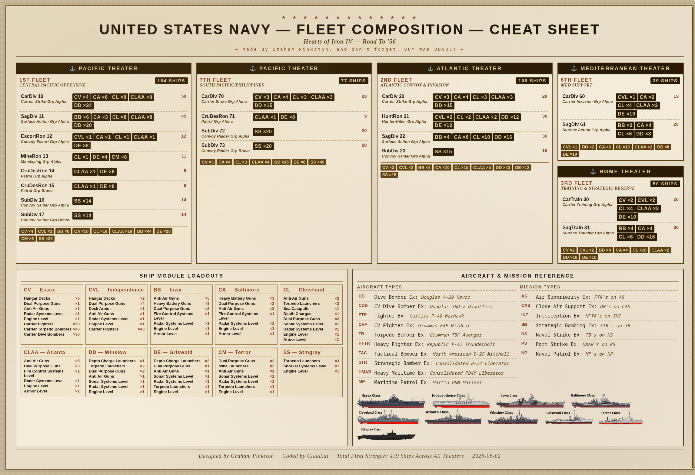
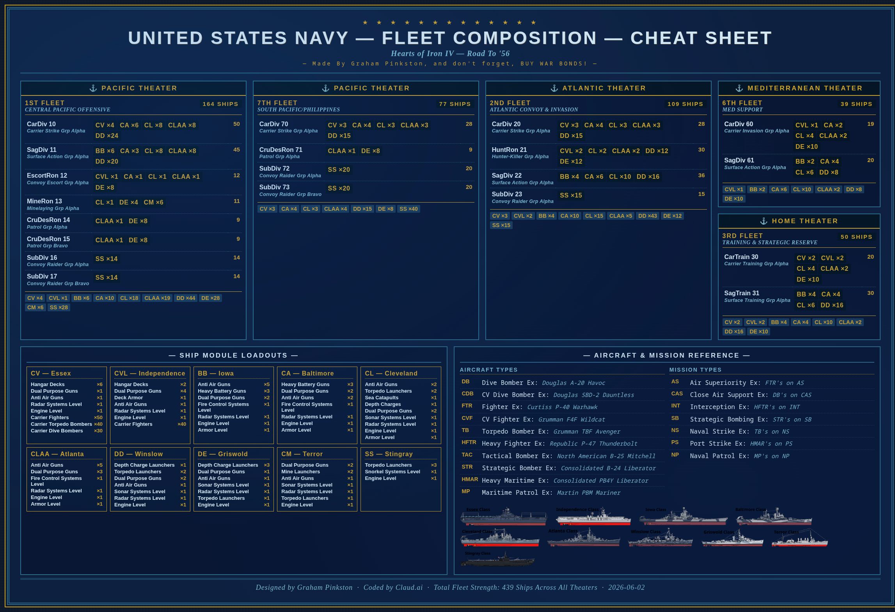

20260602 Work In Progress

The YAML describes your fleet comp, the HTML shows it. Working on a Python script to generate the HTML from the YAML.

Some of the ship silhouettes are wrong, yes I know. I had trouble finding a good PNG for the Terror class and others.

Some of the lingo in the references is probably wrong, chose a placeholder for the time that makes sense to me.






--Prompts

```
I created an HOI4 naval fleet-composition cheat sheet in HTML (see attached PNG screenshot) and I wrote a YAML document (also attached) that describes the navy found in said cheat sheet.

When I wrote the YAML, I used a JSON-first-YAML blend for a human-readable-first, machine-readable-second approach. Now I'm planing on building a generator script to take the data and create the HTML. I no longer care about the data being human readable (outside of rarely hand editing the data) and want a full re-write / re-factoring of my YAML file to two or three JSON files for the consumption of a (probably python) script that will generate said cheat sheet in HTML.

The script will calculate totals, so any calculated totals in the YAML can be stripped out. I think the only totals that need to remain are the count of ships by class per task force. I was experimenting with the anchors and relationships when I wrote the YAML, so you are free to remove them or change them however you see fit. I don't really plan on expanding this project beyond what you see in the cheat sheet mock up, so I'm guessing the relationships aren't needed at all.

I'd like this YAML file broken up into two (or three depending how you look at it) JSON files:

- `fleet.json` will tell the script what theaters/fleets/task forces/ship-class-count should exist in the cheat sheet.

- `references.json` will tell the script what ship-classes/modules/count should exist in `SHIP MODULE LOADOUTS`, as well as what aircraft-types/mission-types should exist in `AIRCRAFT & MISSION REFERENCE`.

- `schema.json` will tell the script how to validate `fleet.json` and `references.json` (assuming you can do that with a single schema file, or we can use two if need be).

Please don't try to teach me, you're just the vibe-coder that is faster than me. Please keep your replies as short as possible until the heat death of the universe occurs.
```