<p align="center">
  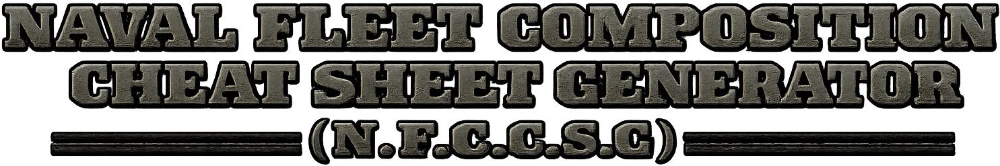
</p>

# N.F.C.C.S.G.
> Work In Progress

### If you're anything like me, you want a great looking cheat sheet on your second monitor to remind you of the fleet you're trying to build in HOI4.
### So I got to work vibe coding a python script that could take a JSON document describing your perfect fleet in text, and export a themed HTML cheat sheet. Presenting NFCCSG, now you can share your based fleet comp with friends in 8 lovely themes.

##### I just started building this thing a few days ago so still very much a work in progress. If you have any thoughts or concerns, please feel free to contact me at [graham.pinkston@gmail.com](mailto:graham.pinkston@gmail.com). I'm sure some of the lingo in the references is probably wrong, these are placeholders that make sense to me.
<br />

Usage:
------
```bash
python main.py --fleet "config/fleet.json" --references "config/references.json" --theme "config/themes.json" --output "cheat_sheet.html" --hide-legend "True"
```
<br />

# Themes

### Navy (with legend)
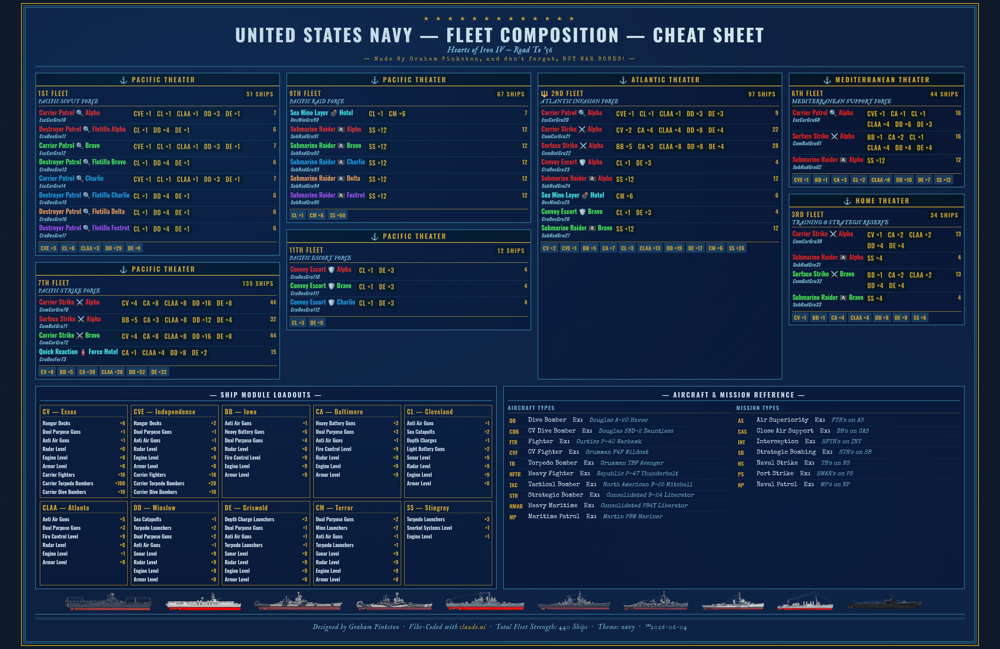

### Navy (without legend)
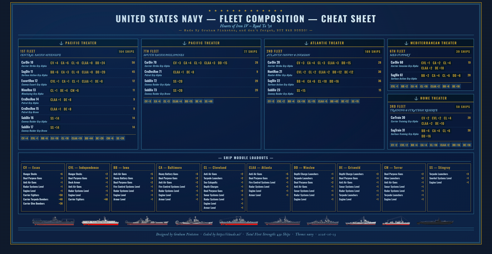

### American (without legend)
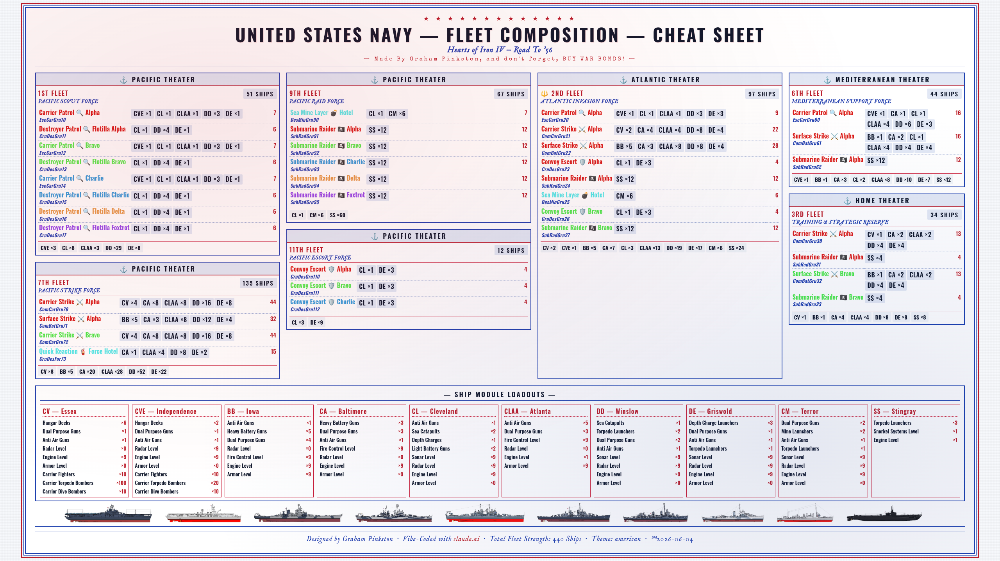

### Code (without legend)
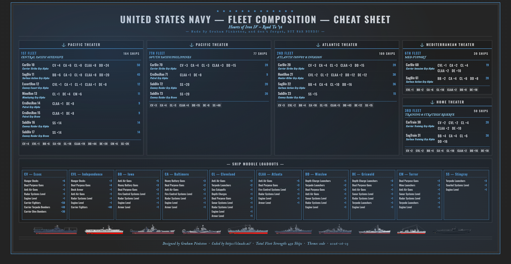

### Harley (without legend)
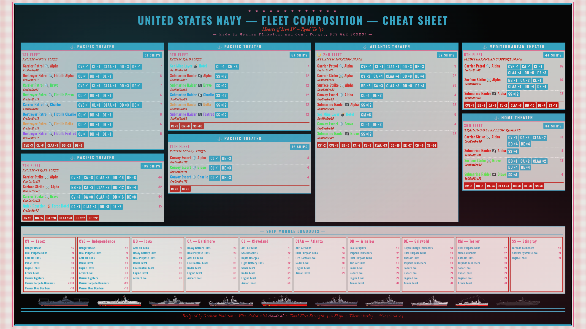

### Parchment (without legend)
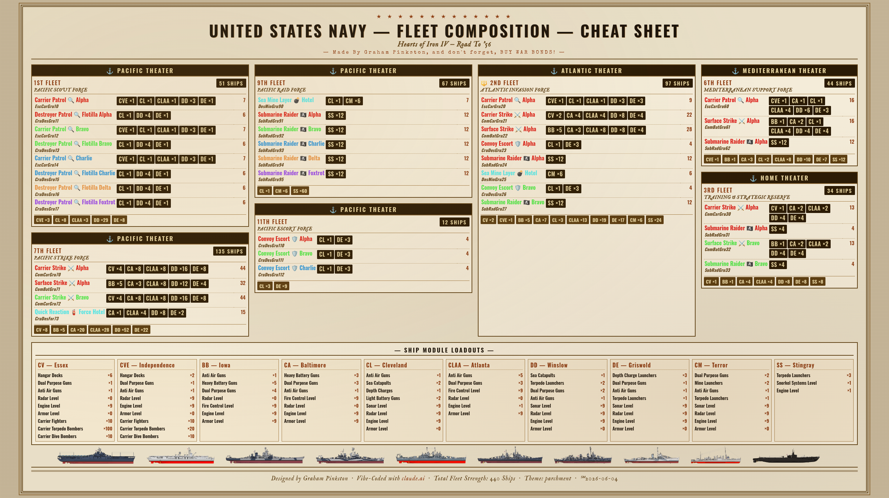

### Patriot (without legend)
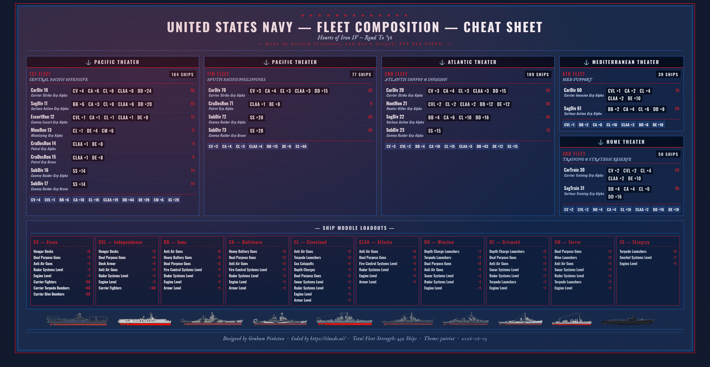

### Pink (without legend)
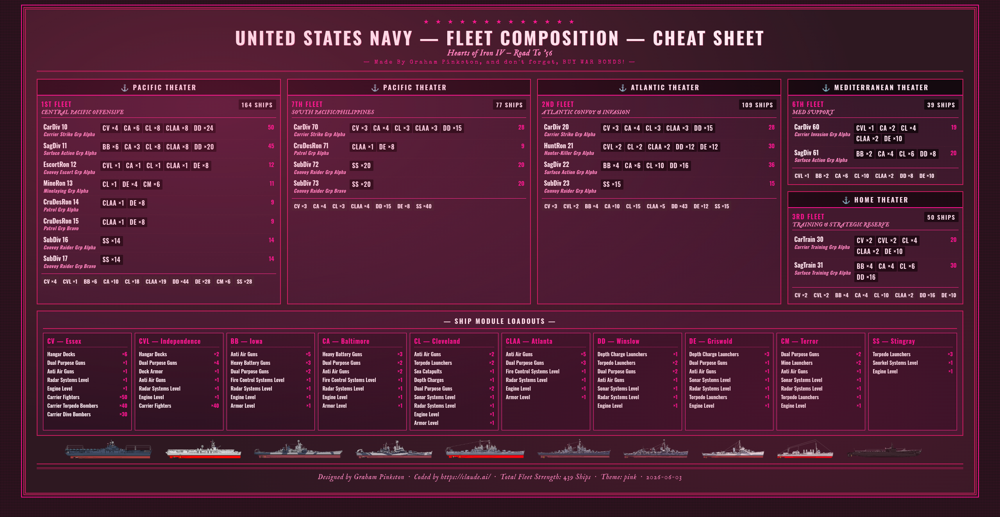

### Ranger (without legend)
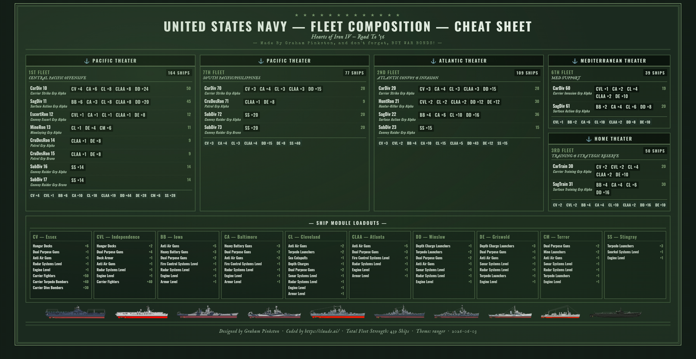

<p align="center">
  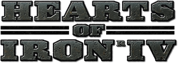
</p>